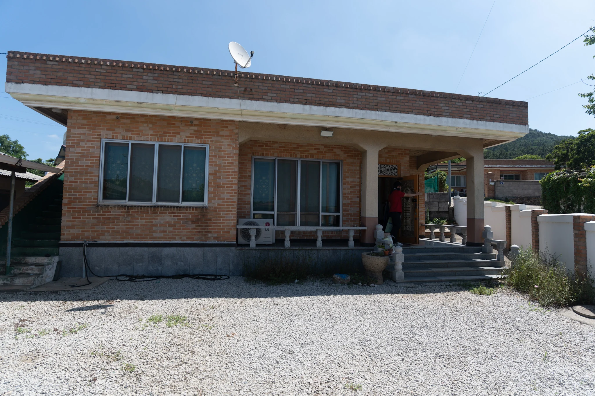
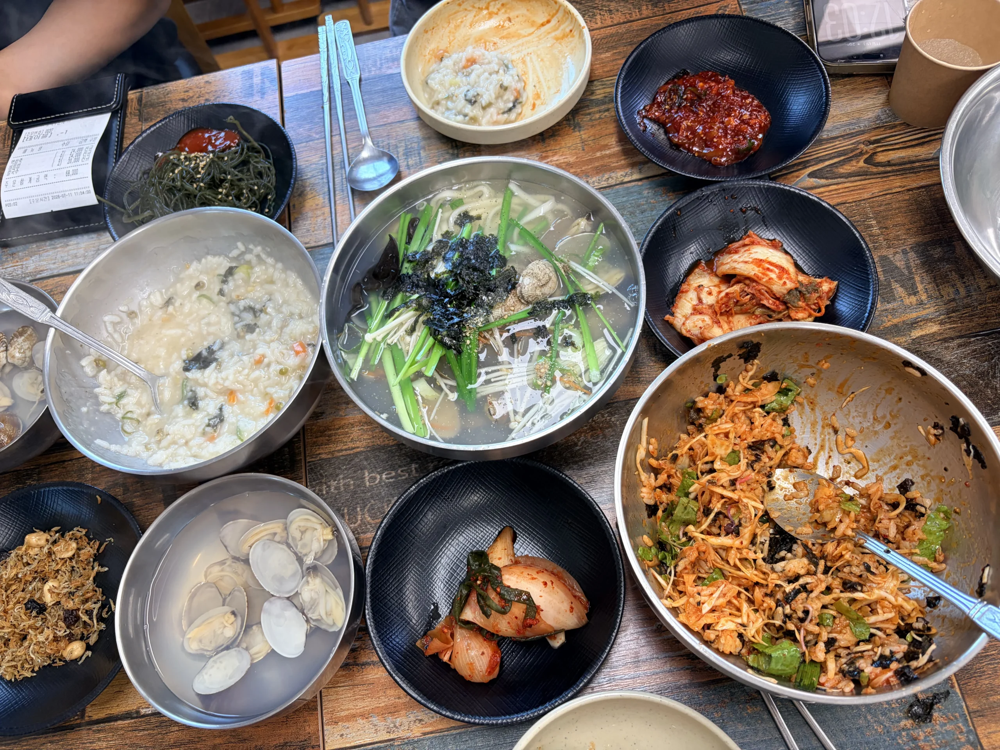
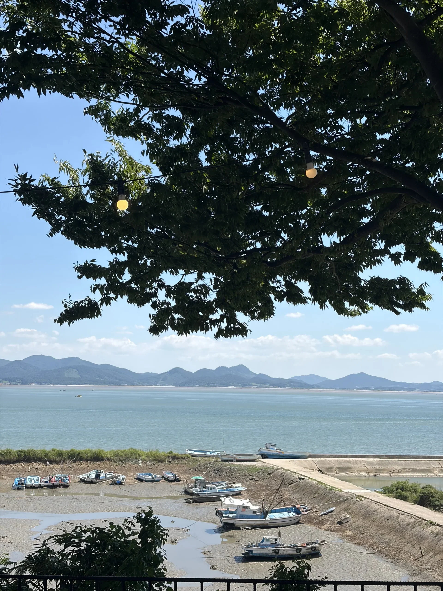
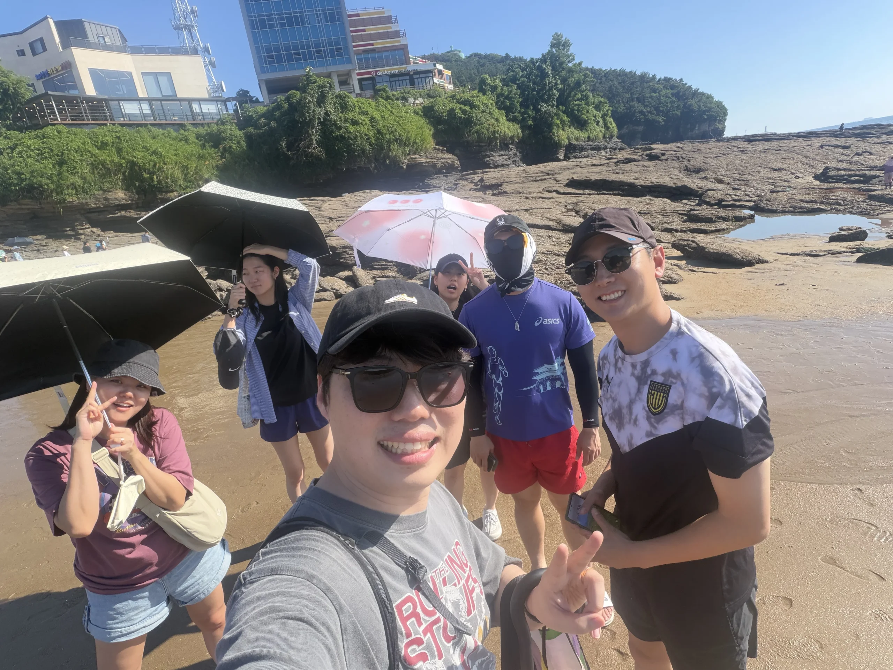
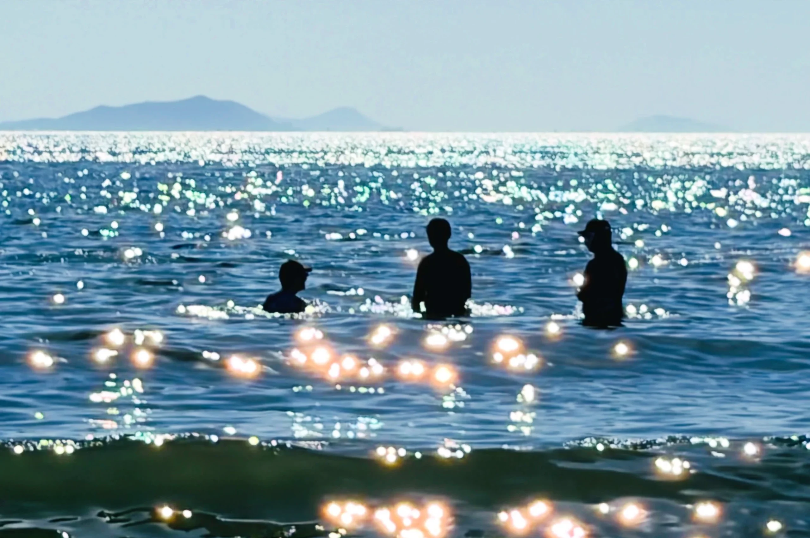
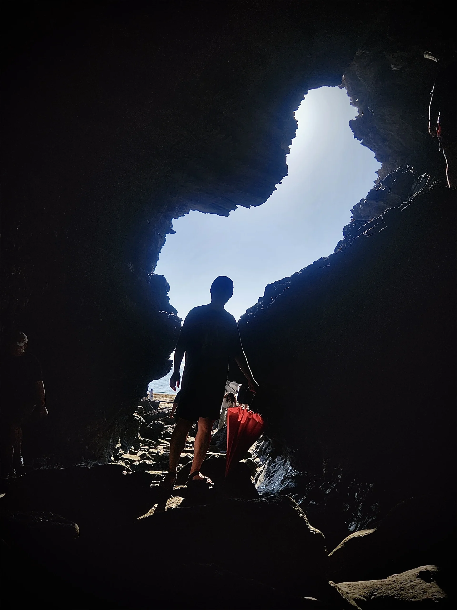
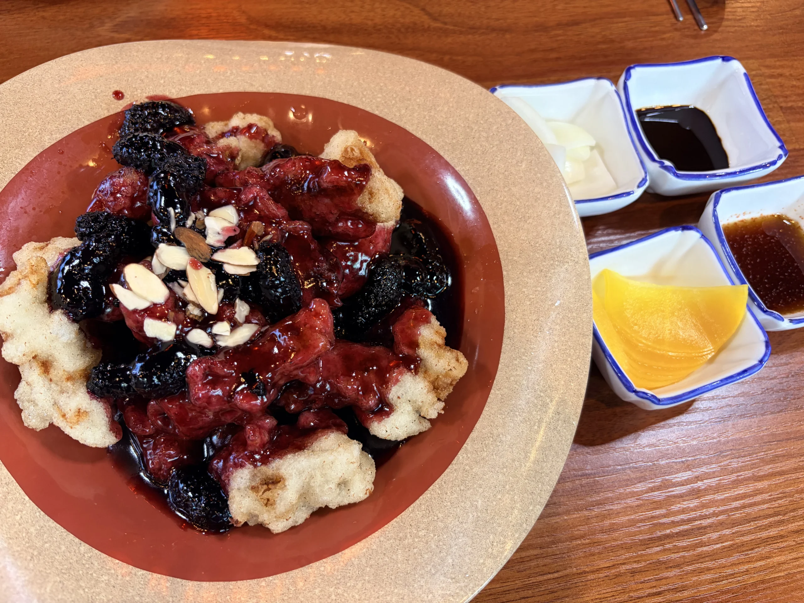
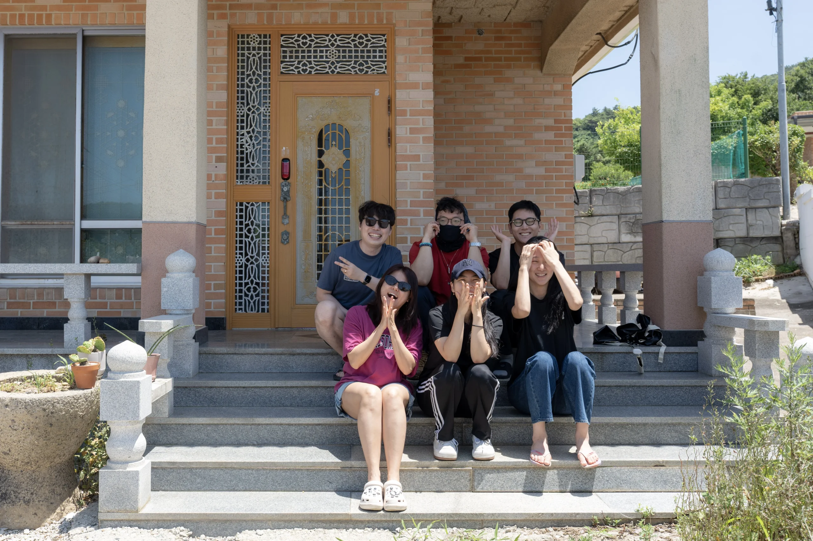

작년 몽골 여행에서 만난 인연들과 여전히 끈끈하게 지내고 있어. 작년 가을 대전 모임 때는 사정상 당일치기로 돌아서야 해서 아쉬움이 컸는데, 올여름 형수의 초대로 전북 부안 1박 2일 여행이 성사됐지. 형수 할머니께서 살던 집을 별장처럼 가꿔둔 곳이라는데, 고즈넉하고 편안한 공간 덕분에 아주 제대로 쉬다 왔어.

약속 시간은 오전 11시. 아쉽게도 우리 부부가 가장 늦게 도착하고 말았어. 30분 지각이라는 소소한 민폐를 끼치며 간단히 짐을 풀고 바로 점심을 먹으러 이동했지.

{/* 여행 요약 상단 대시보드 */}

  <h2 style={{ fontSize: '1.2rem', color: '#1a2a3a', margin: '0 0 18px 0', borderBottom: 'none', textAlign: 'left' }}>
    <strong style={{ color: '#d35400' }}>부안 1박 2일 여행 동선 요약</strong>
  </h2>
  
  {/* 1일차 타임라인 */}
  

    
📍 1일차 동선

    

      

        1
        

          
바다마을 식당 (점심)

          
바지락야채비빔밥(원픽), 바지락칼국수, 백합죽 먹방

        

      

      

        2
        

          
카페 WAVE4

          
오션뷰 감성과 함께한 보드게임(업다운) 한판

        

      

      

        3
        

          
격포해수욕장

          
폭염을 뚫고 뛰어든 시원한 서해 바다 물놀이

        

      

      

        4
        

          
채석강 해식동굴

          
물이 빠진 바윗길을 걸어 도착한 해식동굴 탐방

        

      

    

  

  {/* 2일차 타임라인 */}
  

    
📍 2일차 동선

    

      

        1
        

          
곰소쉼터중국관 (점심)

          
반전의 연속이었던 오디탕수육과 잡채밥 한 상

        

      

      

        2
        

          
곰소젓갈단지 &amp; 귀가

          
양가 부모님 선물용 젓갈 구매 후 여행 마무리

        

      

    

  

## 1일차: 바지락의 재발견과 격포해수욕장

형수의 추천으로 찾아간 곳은 격포해수욕장 인근의 바다마을 식당이야. 바지락야채비빔밥, 바지락칼국수, 백합죽을 균형 있게 주문했어.

  
바다마을 식당 한 줄 평

  
나의 원픽은 단연 <strong>바지락야채비빔밥</strong>. 새콤달콤한 양념과 신선한 바지락의 식감이 기대 이상이라 식사 내내 만족스러웠어. 다음 방문이 기다려지는 맛이야.

만족스러운 식사 후, 오션뷰가 펼쳐지는 카페 WAVE4로 자리를 옮겼어. 바다 바로 옆이라 창밖 풍경이 인상적이었고, 묘하게 일본 감성이 느껴지는 사진들도 건질 수 있었지. 이곳에서 쉬면서 내가 가져간 보드게임 '업다운'을 꺼냈는데, 다행히 모두 재미있게 즐겨줘서 준비해 간 보람을 느꼈어.

카페에서 충분히 담소를 나눈 뒤 숙소로 돌아가 잠시 체력을 충전했어. 그리고 해가 기울 무렵, 남3 여3 조합으로 다시 격포해수욕장으로 향했지.

  여성 멤버들은 그늘에 돗자리를 펴고 휴식을 취했고, 남자 셋은 주저 없이 바다로 들어갔어. 역시 여름에는 바다지.

여행 전날까지 장마로 비가 쏟아지더니, 당일은 거짓말처럼 구름 한 점 없는 맑은 날씨가 펼쳐졌어. 덕분에 날이 엄청나게 더웠는데, 내 아내가 더위를 먹어버린 모양이더라고. 물놀이를 더 즐기고 싶었지만 아내 상태가 걱정되어 아쉬움을 뒤로하고 뭍으로 나왔어.

썰물 때라 해변에서 바윗길을 돌아 채석강 해식동굴로 향했지. 아내는 안색이 너무 안 좋아 곧바로 차에서 쉬게 했는데, 지금 생각해도 정말 잘한 선택이었어. 거리가 꽤 멀어서 같이 움직였다면 큰일 날 뻔했거든.

해식동굴은 유명한 포토스팟답게 사람들로 붐볐어. 날씨마저 더운 데다 습기까지 차올라 오래 머물지 못하고 빠르게 사진만 찍고 나왔지. 날이 선선할 때 다시 오면 좋겠다는 생각이 들더군. 복귀할 때는 차도를 따라 걸어 숙소로 돌아왔어.

## 덤앤더머의 촛불 사수 작전과 밤샘 게임

다른 팀원들이 장을 봐오는 동안 우리는 숙소에 먼저 도착해 깨끗이 씻었어. 해가 질 무렵 마당에 자리를 잡고 본격적인 바비큐 파티를 준비하는데, 뜻밖의 난관에 봉착했지. 아무도 라이터를 챙기지 않은 거야.

다행히 준석네 부부가 대전 성심당에서 사 온 케이크용 초와 성냥이 있었어. 하지만 준석이가 성냥 2개를 모두 허무하게 날려버리면서 긴장감이 고조됐지. 이때 내가 아이디어를 냈어.

  
<strong style={{ color: '#d35400' }}>가스레인지 촛불 이송 작전 🕯️</strong>

  {/* 유튜브 쇼츠 플레이어 */}
  

    <iframe 
      src="https://www.youtube.com/embed/qHDly6ClG34" 
      title="YouTube Shorts video player" 
      allow="accelerometer; autoplay; clipboard-write; encrypted-media; gyroscope; picture-in-picture; web-share" 
      allowFullScreen={true}
      style={{ position: 'absolute', top: 0, left: 0, width: '100%', height: '100%', borderRadius: '12px', border: 'none' }}>
    </iframe>
  

  

    방 안 가스레인지에서 초에 불을 붙여 마당까지 모셔 오는 기발한 생각이었지. 하지만 실전은 달랐어. 밖으로 나오자마자 바람에 촛불이 꺼지려 해서 종이로 바람을 막고, 손에는 <strong>뜨거운 촛농이 떨어지는데</strong> 불이 꺼질까 봐 뛰지도 못하는 진풍경이 연출됐거든. 준석이와 나의 이 <strong>덤앤더머 같은 쌩쇼</strong>는 영상으로 남아 계속 웃음을 주고 있어.
  

우여곡절 끝에 피운 숯불에 구워 먹은 돼지고기와 낮에 사 온 회의 조합은 그야말로 완벽했어. 밤에는 방에 모여 새벽 2시까지 보드게임 삼매경에 빠졌지. 야단법석 달리기, 갱스터, 시타델까지 달리며 알찬 밤을 보냈어.

## 2일차: 월드컵 관람과 오디탕수육의 신세계

둘째 날 아침, 먼저 일어난 멤버들은 2026 북중미 월드컵 8강 노르웨이 대 잉글랜드 전을 보고 있더군. 나는 다음 경기인 아르헨티나 대 스위스 경기 시작 전에 일어나 함께 관람했어.

아르헨티나가 전반 10분 만에 선제골을 넣으며 기세를 잡았지만, F성향인 나는 수세에 몰린 스위스를 응원하게 되더라고. 그러다 후반에 스위스가 동점골을 터뜨리며 분위기가 반전되는 듯했어. 하지만 얼마 지나지 않아 스위스의 엠볼로 선수가 퇴장을 당하고 말았지.

10명으로 연장전까지 버틴 스위스의 투지는 대단했지만, 연장 후반 아르헨티나에게 연속 2골을 허용하며 경기는 3:1 아르헨티나의 승리로 끝났어. 몰입감이 엄청난 경기였지.

경기가 끝난 후 숙소를 후다닥 정리하고 점심을 먹으러 곰소쉼터중국관으로 이동했어.

형수가 추천한 짬뽕 대신 나는 잡채밥을 선택했고, 다 같이 주문한 오디탕수육을 맛봤는데 이게 진짜 별미였어. 달콤하고 상큼한 오디 소스의 매력이 독보적이더라고. 다른 식사 메뉴는 평범했지만, 오디탕수육 하나만으로도 충분히 방문할 가치가 있었어.

각자 돌아갈 길이 멀고 피로가 누적되어 카페 일정은 생략하고 식당에서 인사로 마무리를 지었어. 나와 아내는 곰소젓갈단지에 들러 양가 부모님께 드릴 선물용 젓갈과 우리가 먹을 젓갈을 챙겨 집으로 복귀했지.

## 여행을 마치며

1박 2일의 짧은 일정이었지만 이번 여름 휴가는 정말 알차게 보냈어. 8월에는 별도 휴가가 없고, 9월 추석 연휴에 맞춰 결혼 1주년 기념 국내 여행을 기획해 보려고 해.

몽골 크루들과 다시 한번 뜻깊은 시간을 보낼 수 있어서 참 행복했어. 가을에는 우리 집으로 멤버들을 초대하기로 했는데, 그때는 또 어떤 특별한 시간을 준비해야 할지 즐거운 고민이 시작됐네.