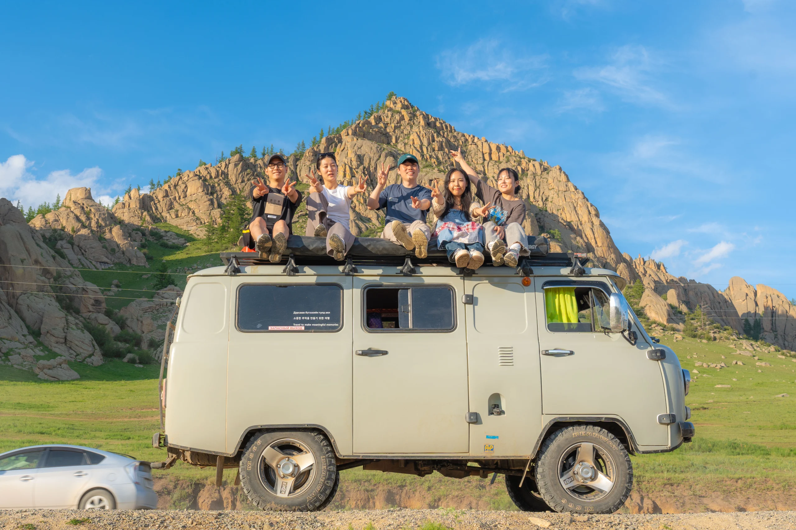
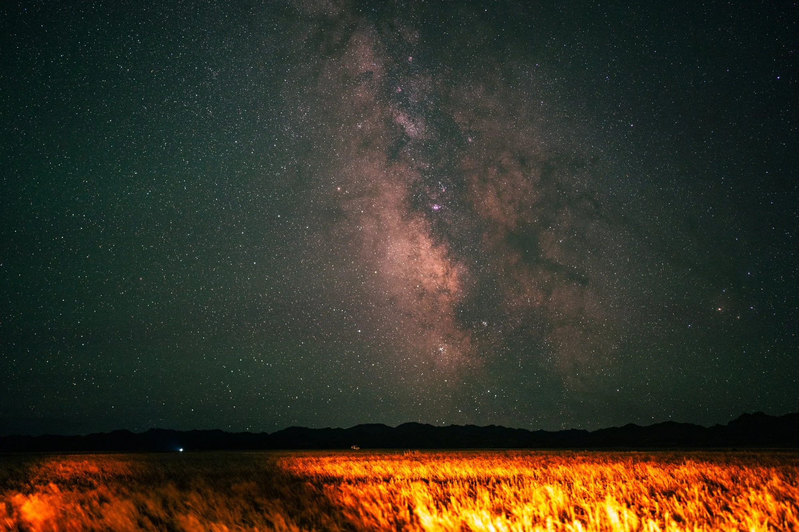

벌써 내가 몽골로 떠난 지 1년이라는 시간이 흘렀네. 작년 이맘때, 5박 6일 동안 대자연의 품속에서 고생하며 보냈던 그 뜨겁고 찬란했던 몽골 여행의 추억과 내가 왜 몽골을 선택했었는지 그 이야기를 풀어보려고 해.

## 왜 하필 한여름의 몽골이었을까?

나는 거의 매년 해외여행을 다녔을 정도로 여행을 좋아해. 작년 여름에도 휴가철이 다가오면서 어느 나라로 떠나면 좋을지 행복한 고민에 빠졌었지. 보통은 겨울에 해외를 많이 나갔던 터라 선택지가 많았는데, 겨울 동남아는 건기라서 여행하기 딱 좋거든. 하지만 이번엔 **한여름에 떠나는 휴가**라는 게 문제였어.

여름 동남아는 아쉽게도 우기라서 습하고 비가 많이 오잖아? 굳이 휴가까지 가서 눅눅한 우기를 겪고 싶진 않더라고. 그렇게 열심히 여름 해외여행 추천지를 검색하다가 운명처럼 **'몽골 여행'**을 알게 되었어. 우리나라보다 훨씬 고위도에 위치한 몽골은 한여름에도 기온이 낮아 여행하기 쾌적하다는 말에 마음이 확 쏠렸지.

## 30대 중반, 대도시에서 대자연의 매력으로

내 마음을 뒤흔든 건 날씨뿐만이 아니었어. 끝없이 펼쳐진 푸른 초원, 밤하늘을 수놓는 은하수, 그리고 드넓은 땅을 떼지어 다니는 양과 염소들... 상상만 해도 가슴이 뻥 뚫리는 기분이었지. 돌이켜보면 20대까지만 해도 화려한 주요 관광지나 대도시 중심으로 여행하는 걸 참 좋아했었거든? 그런데 **30대 중반을 넘기면서부터**는 신기하게도 이런 가슴 웅장해지는 자연광경이 너무 좋아지더라고.

> 지평선 끝에서 반대쪽 지평선 끝까지가 전부 하늘이었던 곳. 하늘이 그렇게 넓다는 걸 나는 몽골에 가서야 처음 알게 되었다.

하지만 몽골 여행에는 단 한 가지 큰 걸림돌이 있었어. 바로 완벽한 오지여행이기 때문에 **개인 자유여행이 불가능하다**는 점이었지. 그래서 대개 동행을 구해 팀을 꾸려서 움직여야 해. 몽골의 거친 길을 달리는 오프로드 차량인 **'푸르공'**의 최대 탑승 인원이 6명(운전사, 가이드 제외)이라 보통 한 팀에 최대 6명으로 짜이게 돼.

*승차감은 꽝이었지만 우리에게 최고의 아지트가 되어준 귀여운 푸르공*

## 네이버 카페 '러브몽골'에서 만난 소중한 인연들

나 역시 동행을 찾기 위해 몽골 여행자들의 성지인 네이버 카페 **'러브몽골'**의 문을 두드렸어. 운이 좋게도 대규모 팀원들을 이끄는 능력자 팀장님을 만나게 되었고, 우리 팀은 총 20명 정도의 대인원으로 꾸려졌지. 우리는 푸르공 2대와 하이에이스 1대, 총 3대의 차량에 나눠 타고 6일간의 대장정을 시작했어.

몽골 여행은 기본적으로 **엄청난 장거리 운전 여행**이야. 아침에 출발해서 오후 늦게 도착하는 게 일상이고, 많게는 비포장도로를 무려 8시간 동안 이동한 적도 있었어. 푸르공이 러시아 군용 차량을 개량한 거라 험한 초원이나 사막에서의 기동성은 끝내주는데, **승차감은 솔직히 그냥 꽝**이거든? 가만히 있어도 몸이 춤을 추는 수준이야. 하지만 우리 2조 멤버들은 성향이 다들 너무 좋아서, 그 흔들리는 차 안에서도 서로 웃고 떠들고, 심지어 잠도 참 잘 잤어.

## 평생 잊지 못할 밤하늘의 은하수, 그리고 자연 화장실

몽골에서 가장 기억에 남는 순간을 꼽으라면 단연 **밤하늘의 은하수**야. 내 평생 그렇게 압도적으로 많은 별을 본 날이 또 있었을까? 땅바닥에 돗자리를 깔고 그냥 가만히 누워서 하늘을 바라보는 것만으로도 가슴이 벅차오르고 온전한 힐링이 되더라고. 끝없는 땅과 하늘을 보며 무한한 가능성을 선물 받는 기분이었어.

> 매일 밤 은하수를 기대했지만 구름이 가득한 날도 있었다.  
> 그래도 6일 중 3일은 아주 맑은 하늘 속에서  
> 우주의 신비를 눈에 담을 수 있었으니 난 행운아다.

물론 낭만만 있었던 건 아니야. 많은 사람들이 걱정하는 것처럼 **화장실 시설은 정말 열악함 것 자체**였어. 온 사방이 그냥 탁 트인 자연 화장실이거든. 그래서 몽골 여행은 비위가 좀 강하고 무던한 사람들에게 제격이라는 생각이 들었어. 모든 면에서 완벽하고 편안할 수는 없는 여행이니까.

*쏟아질 듯 감동적이었던 몽골의 밤하늘, 다시 봐도 가슴이 뛴다.*

## 고생 끝에 남은 추억, 그리고 무조건 강추하는 이유

시설도 불편하고 비포장도로에서 엉덩이가 깨질 것 같은 고생을 했지만, 신기하게도 짜증 한번 내는 사람 없이 모두가 웃으면서 여행을 즐겼어. 그런 힘든 환경을 함께 버텨내서일까? 같이 푸르공을 타고 달렸던 **우리 2조 멤버들**과는 여행이 끝난 지금까지도 종종 연락을 이어오고 있어. 벌써 따로 두 번이나 모여서 추억담을 나눴을 정도로 소중한 인연이 되었지.

지금 누군가 여름 휴가로 몽골 여행을 고민하고 있다면, 나는 두말할 필요 없이 무조건 강추하고 싶어. **여행은 몸이 조금 고생해야 기억에 오래 남는 법**이거든. 그 순간만큼은 몸이 힘들지 몰라도, 시간이 흐른 뒤 지금의 나처럼 평생 웃으며 회상할 수 있는 최고의 추억이 될 테니까 말이야!