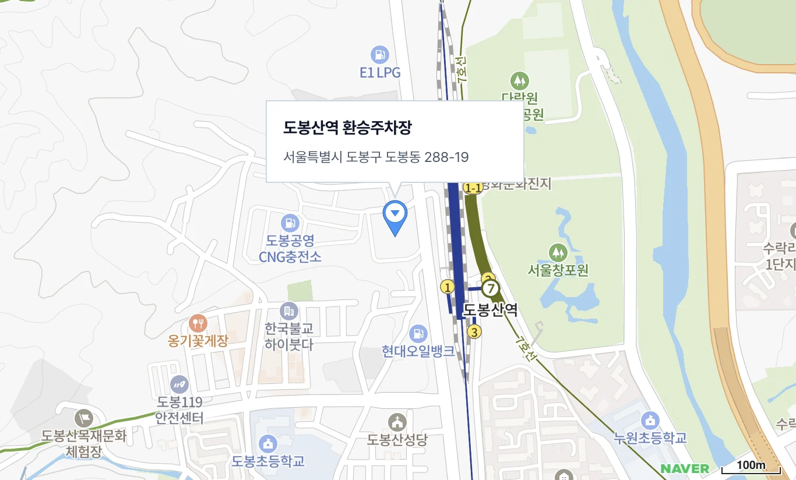

{/* 서두 감성 상자 */}

  서울 한번 나갈 때마다 주차 전쟁에 주차비 폭탄까지... 머리 아팠던 적 많지? 이번에 양재 결혼식 가면서 찾아낸 '역대급 주차비 절약 치트키'를 알려줄게!

주말에 서울 양재에서 지인 결혼식이 있었어. 그런데 다들 알잖아? 서울은 차를 가져가는 순간부터 고통의 시작이라는 걸. 차는 막히지, 겨우 주차장 찾아 들어가면 주차비는 무슨 금값이지...

결혼식장 주차장이 있긴 하겠지만 주말 강남/양재 도로 상황을 생각하니 도저히 차를 끝까지 끌고 갈 엄두가 안 나더라고. 그래서 이번엔 대중교통을 타기로 마음먹었지.

  경기 북부 운전자들의 구원투수, 도봉산역 환승주차장!

## 경기 북부 주민의 서울 진입 전략, 도봉산역!

{/* 위치 안내 카드 */}

  <h3 style={{ margin: '0 0 10px 0', fontSize: '18px', color: '#1a2a3a', fontWeight: 'bold' }}>📍 도봉산역 환승주차장 위치 안내</h3>
  
  

    
도봉산역 환승주차장

    
서울특별시 도봉구 마들로 932 (도봉동 1-8)

    
    

      <a href="https://map.kakao.com/link/map/도봉산역환승주차장,37.6892,127.0463" target="_blank" rel="noopener noreferrer" style={{ display: 'inline-block', padding: '8px 14px', fontSize: '0.85rem', fontWeight: 'bold', textDecoration: 'none', borderRadius: '6px', backgroundColor: '#fee500', color: '#000000' }}>
        카카오맵에서 보기
      </a>
      <a href="https://map.naver.com/v5/search/도봉산역환승주차장" target="_blank" rel="noopener noreferrer" style={{ display: 'inline-block', padding: '8px 14px', fontSize: '0.85rem', fontWeight: 'bold', textDecoration: 'none', borderRadius: '6px', backgroundColor: '#03c75a', color: '#ffffff' }}>
        네이버지도에서 보기
      </a>
    

  

하지만 우리 집에서부터 처음부터 지하철이나 버스를 타고 가려니 시간이 너무 오래 걸리는 게 문제였어. 그래서 내가 선택한 방법은 바로 '도봉산역 환승주차장'까지 차로 이동한 뒤, 거기서 지하철 7호선을 타고 목적지로 쏜다!

경기 북부 쪽에서 서울 들어갈 때 내가 정말 자주 이용하는 주차장인데, 여기가 진짜 숨은 보물 같은 곳이야. 이유가 뭐냐고? 환승 할인 혜택이 미쳤거든!

## 전기차(EV3) + 저공해 환승 = 5시간에 1,400원?!

내 차는 EV3 전기차거든? 보통 공영주차장에 대면 기본 50% 할인이 적용돼. 이것만 해도 감지덕지인데, 지하철을 이용하고 돌아와서 환승 할인을 적용받으면 할인율이 뿜뿜 올라가!

{/* 영수증 HTML 카드 */}

  

    
    

    
주차영수증

    
    

      
상&nbsp;&nbsp;&nbsp;&nbsp;호 :서울시설공단

      
대 표 자 :한국영

      
주차장명 :도봉산역

      
주&nbsp;&nbsp;&nbsp;&nbsp;소 :서울시 도봉구 도봉동 288-19

      
전화번호 :02-2290-6047

      
사 업 자 :206-82-04293

    

    

    
주차권번호 :364723

    

    

      
차량번호 :07어3953

      
입차시간 :2026-07-25T12:24:13

      
출차시간 :2026-07-25T17:27:18

      
주차시간 :5시간 3분 5초

      
결제기기 :B2환승 사전

    

    

    

      
주차요금 :17,080

      
할인유형 :저공해환승

      
할인금액 :15,680

      
영수금액 :1,400

      
공급가액 :1,400

      
부 가 세 :0

    

    

    

      
결제수단 :현대카드

      
카드번호 :94901300

      
승인번호 :00529651

      
결제금액 :1,400

    

    

    
환승시각 :2026-07-25 17:23 (3분)

    

    

      발 행 일 자 : 2026-07-25
    

    
감사합니다.

  

  총 5시간 3분 주차하고 최종 결제된 금액은 단 1,400원!

오늘 주차장에 총 5시간 3분 동안 차를 세워뒀는데, 정산기에서 최종 결제된 금액을 보고 내 눈을 의심했잖아. 단돈 1,400원! 요즘 메가커피 아메리카노 한 잔 값도 안 되는 미친 가격이야.

## 도대체 요금이 어떻게 계산된 걸까?

궁금해서 계산법을 꼼꼼하게 따져봤어.

  

    <strong>1. 최초 3시간 무료 (면제)</strong> 
    저공해/경차 환승 차량은 입차 후 첫 3시간 동안 주차요금이 <strong>0원</strong> 처리돼. 즉, 5시간 3분 중에서 3시간을 뺀 <strong>2시간 3분(약 125분)</strong>에 대해서만 초과 요금이 부과되는 거지!
  

  

    <strong>2. 초과 시간 요금 산정</strong> 
    도봉산역 환승주차장 기준(5분당 170원)으로 2시간 3분(25회 부과)을 계산하면 약 <strong>4,250원</strong>의 원금이 나와.
  

  

    <strong>3. 초과분에 대한 80% 추가 할인!</strong> 
    여기서 지하철 환승 혜택(80% 감면)이 적용되면서 실제 납부할 금액이 획기적으로 줄어들어 최종 <strong>1,400원</strong>만 청구된 거야!
  

결국 '최초 3시간 무료 + 초과분 80% 할인'이라는 기적의 더블 혜택이 들어가면서 이 어마무시한 가격이 나온 거야!

## 학여울역 환승주차장은 이제 비추하는 이유

사실 예전에 강남 쪽 갈 때는 학여울역 환승주차장도 자주 썼었어. 그런데 거기는 어느 순간부터 환승할인 적용 대상에서 제외됐더라고.

이제는 전기차 50% 할인만 달랑 적용되는데, 지난번에 갔다가 주차비만 1만 원 넘게 깨지고 나서는 다신 안 가기로 마음 접었어.

## 서울 주차 꿀팁 총정리

  1. 경기 북부에서 서울 진입 시: <strong>도봉산역 환승주차장</strong> 강력 추천 (저공해/경차/환승객 최고!) 
  2. 서울 타 지역 방문 시: <strong>'모두의 주차장'</strong> 앱 활용 (당일권 미리 사면 6~7천원 대 가능)

주말에 차 끌고 서울 나갈 일 있는 경기 북부 사람이라면 괜히 서울 한복판 들어가서 주차비 폭탄 맞지 말고 도봉산역 환승주차장 꼭 활용해 봐! 강력 추천한다!