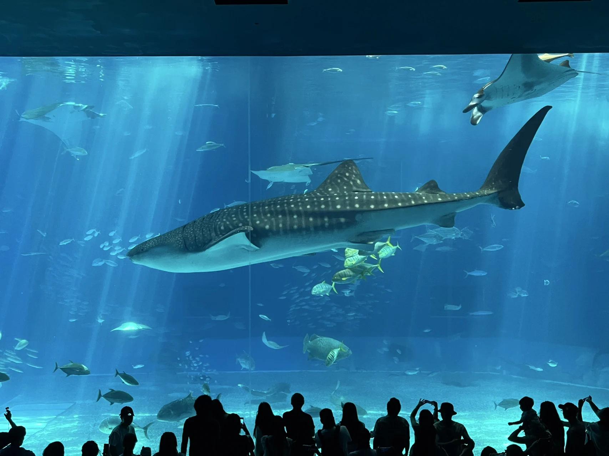
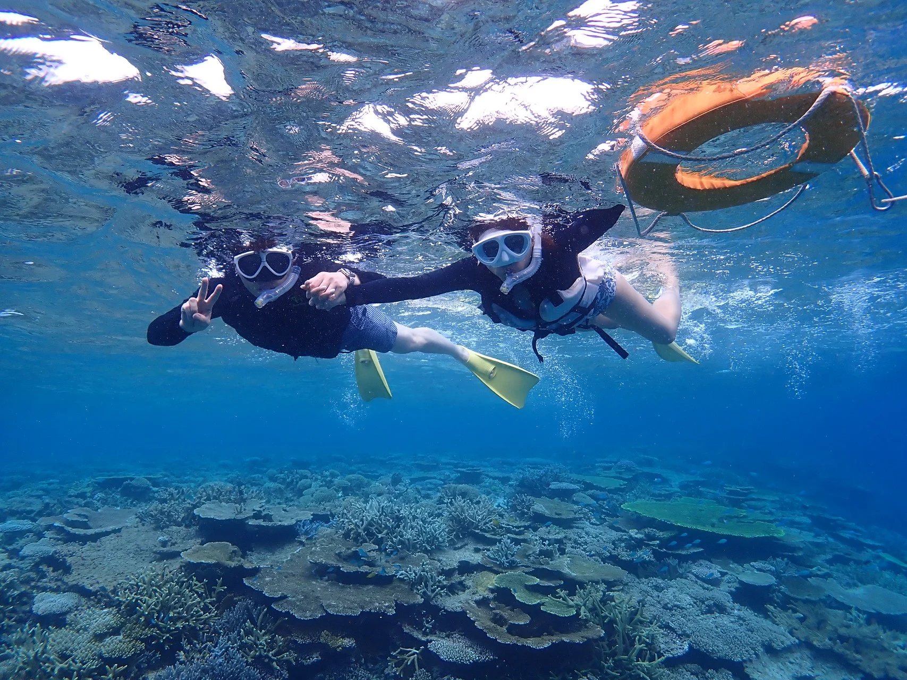

결혼식 치르고 체력 바닥났는데, 신혼여행까지 10시간 넘게 비행기 타고 갈 수 있어? 솔직히 남들 다 가는 발리나 하와이도 생각했지만... 장거리 비행은 딱 질색이라 과감하게 패스했지!

무조건 "가깝고, 조용하고, 바다가 미치게 예쁜 곳"만 찾다가 운명처럼 발견한 곳이 있어.

바로 '일본의 몰디브'라 불리는 미야코지마! 인천에서 직항으로 딱 2시간 30분이면 도착해. 비행기 오래 타는 거 싫어하는 사람한테는 완전 천국이지!

{/* 1회용 아고다 숙소 추천 카드 */}

  
  

    추천 휴양지
    <h3 class="agoda-title">미야코지마 리조트 & 호텔 찾기</h3>
    
에메랄드빛 바다와 야비지 스노클링을 즐길 수 있는 최고의 숙소를 확인하세요.

    <a href="https://www.agoda.com" target="_blank" rel="noopener noreferrer" class="agoda-btn">
      
Agoda에서 미야코지마 최저가 예약하기

    </a>
  

▲ 보자마자 감탄만 나오는 미야코지마의 에메랄드빛 바다

---

## 오키나와 & 미야코지마 5박 6일 코스

나는 한곳에만 가만히 있는 것보다 여러 풍경을 즐기는 걸 좋아해. 그래서 이번 신혼여행은 오키나와 본섬 3일 + 미야코지마 3일 조합으로 알차게 짜봤어.

사실 예전부터 오키나와는 꼭 가보고 싶었는데, 우핸들 운전이랑 렌트카 부담 때문에 미루고 있었거든. 하지만 신혼여행이니까 큰맘 먹고 도전! 결론부터 말하자면 운전도 금방 적응되고 완전 대만족이었어.

> "오키나와에 간 진짜 이유? 바로 츄라우미 수족관의 마스코트, 거대한 '고래상어'를 눈앞에서 보기 위해서!"

{/* 1회용 인터랙티브 이미지 슬라이더 */}
{/* 

  

    

      

        
        츄라우미 수족관의 거대한 고래상어
      

      

        
        해안 도로 드라이브 코스
      

      

        
        오키나와 본섬의 평화로운 풍경
      

    

  

  <button class="sk-slider-btn prev" aria-label="이전 슬라이드">❮</button>
  <button class="sk-slider-btn next" aria-label="다음 슬라이드">❯</button>
  

▲ 좌우로 슬라이드해서 보는 오키나와 본섬 3일간의 기록
 */}

웅장하게 헤엄치는 고래상어를 직접 보는데 진짜 가슴이 웅장해지더라. 첫 3일간의 오키나와 일정도 정말 알찼어.

---

## 하지만 진국은 따로 있었다... 미야코지마의 반전 매력

오키나와 일정을 마치고 드디어 미야코지마에 도착했어. 그런데 다녀오고 나니까... "아, 그냥 미야코지마에서만 6일 풀로 보낼 걸!" 하고 후회할 정도로 훨씬 좋았어.

작고 고즈넉한 시골 섬마을인데, 하루하루가 정말 영화 같았거든.

- 낮: 투명하다 못해 눈부신 바다에서 물놀이하기
- 저녁: 아기자기한 섬 시내에서 쇼핑하고 숨은 로컬 맛집 찾아다니기

> "이 여행의 하이라이트, '야비지(八重干瀬) 스노클링'은 진짜 인생 최고의 순간이었어!"

▲ 투명한 바닷속 수많은 산호와 물고기들

세상에... 이렇게까지 맑고 투명한 바닷물이 존재하다니. 눈앞에서 수만 마리의 알록달록한 물고기들이 헤엄치는데 환상 그 자체였어. 단 1원도 아깝지 않으니까 미야코지마 가면 야비지 스노클링은 무조건 강추! 이거 안 할 거면 미야코지마 갈 이유가 없을 정도로 메인 테마야.

---

## 다시 돌아가야 할 확실한 이유

미야코지마 해변은 바다거북을 정말 쉽게 볼 수 있는 곳으로 유명하거든? 그런데 우리는 아쉽게도 이번에 거북이를 한 번도 못 만났어 😭

하지만 오히려 좋아! 아내랑 "거북이 보러 다음에 꼭 다시 오자!"라고 기분 좋게 기약하며 신혼여행을 마무리했거든.

참고로 오키나와 현의 또 다른 보석 같은 휴양지인 이시가키섬도 휴양하기에 정말 좋아서, 다음 여행 후보지로 꼭 염두에 두고 있어!

  <h3>💡 신혼여행 요약 한 줄 평</h3>
  
비행시간 짧고, 바다 역대급으로 맑고, 휴양과 맛집까지 다 잡고 싶다면? <strong>미야코지마는 무조건 정답이다!</strong>

{/* 2. 포스트 전용 1회용 CSS (MDX 격리 스코프) */}

{/* 3. 포스트 전용 1회용 JavaScript (슬라이더 & 애니메이션 실행) */}
