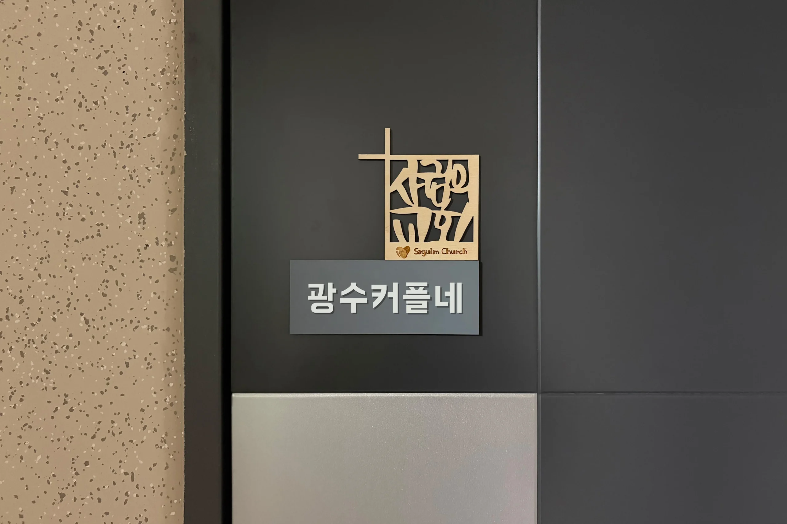

드디어 우리 집 대문에도 교회의 흔적이 남게 되었어. 작은 명패 하나가 주는 소속감과 안정감, 그리고 새로운 섬김을 준비하는 설레는 일상을 기록해 볼게.

## 기다리던 사귐의교회 명패, 드디어 내 손에!

교회에 처음 등록한 지 벌써 두 달이 지났나 봐. 새가족 환영회를 거쳐 '풍삶초(풍성한 삶의 기초)' 양육 과정까지 무사히 수료했어. 그때 새가족 선물로 예쁜 유리컵이랑 사귐의교회 전용 텀블러, 수건까지 한가득 받았지 뭐야.

그런데 선물을 잔뜩 받고도 내가 가장 먼저 한 말은 "근데, 명패는 어디 있지?"였어. 현관문에 우리 교회 명패를 딱 붙이는 게 내 작은 로망이었거든. 막상 명패가 없어서 내심 아쉬웠는데, 2주를 더 기다린 끝에 드디어 정식 교인의 상징인 명패를 받게 되었어! 이제 진짜 한 식구가 된 것 같아 기분이 너무 벅차올라.

## 은혜로운 말씀과 관계의 회복

그리고 얼마 전, 목사님께 반가운 카톡 안내를 받았어. 전 교인이 모여있는 단톡방과 네이버 밴드에 초대해 주신 거야. 매주 들려주시는 말씀이 어찌나 은혜로운지 몰라. 올 한 해는 이 생명력 있는 말씀을 들으면서 지쳤던 내 마음이 온전히 회복되기를 간절히 소망하고 있어.

특히 하나님과의 소통이 깊어지면서, 과거에 내가 먼저 뿌리치고 놓아버렸던 관계들도 다시 따뜻하게 회복되는 기적이 일어나길 기도하는 중이야. 교회에서 보내준 웰컴 메시지가 너무 따뜻해서 캡처하듯 그대로 담아봤어.

  

    
    {/* Status Bar */}
    

      09:41
      

        📶
        🔋
      

    

    {/* Header Bar */}
    

      

        ‹
        
사귐

        

          

            사귐의교회 ✓
          

          
알림톡 서비스 | 새가족안내

        

      

      

        🔍
        ≡
      

    

    {/* Chat Content Area */}
    

      
      {/* Date Pill (이슈 해결 영역) */}
      

        
          2026년 7월 23일 목요일
        
      

      {/* Message Bubble Section */}
      

        

          사귐
        

        
        

          
사귐의교회 알림톡

          
          

            
            {/* Banner */}
            

              
WELCOME TO COMMUNITY

              
샬롬! 사귐가족이 되심을 환영합니다

            

            {/* Intro Text */}
            

              
사귐의교회에서 여러분을 만나 함께 예배하게 되어 진심으로 감사합니다.

              
사람을 만난다는 것은 참 소중한 일이며, 동시에 신비입니다. 그런 의미에서 저는 여러분을 이제 저의 가족, 우리의 가족으로 받아들이기로 결단합니다.

              
여러분도 같은 마음으로 이 공동체를 품어주시길 바랍니다.

              

  

    저희 교회는 빠른 성장보다 <strong>건강한 성숙</strong>을 더 중요하게 여깁니다. 등록 과정이 비교적 길었던 이유도, 가족이 되는 일을 진지하게 여기기 때문입니다. 그리고 가족이 되었기에, 우리는 서로를 책임지는 공동체가 되고자 합니다.
  

              
그 과정을 잘 따라와 주셔서 감사드리며, 이제 여러분은 정식으로 사귐 가족이 되셨습니다. 앞으로 교회 안의 모든 삶과 여정에 함께 참여하실 수 있습니다.

            

            

            {/* 1. 예배 */}
            

              

                1
                <h3 style={{ fontSize: '14px', fontWeight: 'bold', margin: 0 }}>예배</h3>
              

              
저희 교회는 <strong>주일예배</strong>와 <strong>수요기도회</strong>를 중심으로 공예배가 이루어집니다.

              
또한 월 1회 <strong>‘깊은예배’</strong>가 있으니, 주보와 광고를 통해 일정을 확인해 주세요.

              

                사귐의교회는 예배에 진심인 공동체입니다. 이 예배의 특권을 깊이 누리시기를 바랍니다.
              

            

            {/* 2. 소그룹 */}
            

              

                2
                <h3 style={{ fontSize: '14px', fontWeight: 'bold', margin: 0 }}>소그룹 (에클레시아)</h3>
              

              
교회에는 <strong>‘에클레시아’</strong>라는 소그룹 공동체가 있습니다.

              <ul style={{ paddingLeft: '18px', margin: '6px 0' }}>
                <li style={{ margin: '2px 0' }}>주일 2부 예배 후 모임 진행</li>
                <li style={{ margin: '2px 0' }}>식사 후 오후 4~5시 마무리</li>
                <li style={{ margin: '2px 0' }}>월 1회 ‘언약가족예배’로 인해, 월 3회 정도 모임</li>
              </ul>
              
에클레시아는 꼭 추천드리는 공동체입니다. 신앙은 함께할 때 더욱 깊어지기 때문입니다.

              

                정식 참여를 위해서는 <strong>&lt;에클레시아 디딤돌&gt;</strong> 과정 수료가 필요합니다.
              

              

                <strong>※ 개인 상황에 따라 소그룹 없이 예배만 참여하는 경우</strong> 
                → ‘미소 가족’으로 지내실 수 있으며, 이후 상황이 되시면 에클레시아 디딤돌을 신청하시어 에클레시아 참여가 가능합니다.
              

            

            {/* 3. 양육 */}
            

              

                3
                <h3 style={{ fontSize: '14px', fontWeight: 'bold', margin: 0 }}>양육 (3단계 과정)</h3>
              

              
사귐의교회는 다음과 같은 3단계 양육 과정을 진행합니다.

              
              

                

                  1단계
                  

                    <strong>풍성한 삶으로의 초대 (풍삶초)</strong>
                    3~7주 / 완료 ✓
                  

                

                
↓

                

                  선택
                  

                    <strong>1.5단계: 하나도 (하나님 나라의 도전)</strong>
                    또는 2단계: 풍삶첫 (풍성한 삶의 첫걸음)
                  

                

                
↓

                

                  3단계
                  

                    <strong>풍성한 삶의 기초 (풍삶기)</strong>
                    13주 과정
                  

                

              

              
둘 중 필요한 과정을 마친 후, <strong>에클레시아 디딤돌 → 소그룹 정식 참여</strong>가 가능합니다.

              
※ 하나도/풍삶첫 양육 과정 중에는 이끄미의 에클레시아 탐방이 가능합니다.

            

            {/* 4. 말씀과 개인 훈련 */}
            

              

                4
                <h3 style={{ fontSize: '14px', fontWeight: 'bold', margin: 0 }}>말씀과 개인 훈련</h3>
              

              
              

                <strong style={{ fontSize: '12px' }}>📖 매일성경 묵상</strong>
                
2개월마다 교회에서 묵상집 신청 진행합니다. (일부 비용 교회 지원) 묵상나눔방 참여 가능 (신청을 원하시면 알려주세요, 주 1회 묵상올리기 훈련)

              

              

                <strong style={{ fontSize: '12px' }}>✝️ 원데이원바이블</strong>
                
하루 1장씩 말씀을 읽는 모임입니다. 말씀을 지속적으로 읽는 데 큰 도움이 됩니다. (성경읽기방 참여 가능)

              

              
※ 모르시는 것은 무엇이든 → 새가족팀 또는 에클레시아에서 문의 가능합니다.

              

                
📞 교역자 / 목양팀 연락처

                

                  
담임목사: 010-XXXX-XXXX

                  
사모: 010-XXXX-XXXX

                  
전도사: 010-XXXX-XXXX

                  
간사: 010-XXXX-XXXX

                

                
* 필요할 때 언제든 도움을 청하시면 됩니다.

              

            

            {/* 5. 소통 채널 */}
            

              

                5
                <h3 style={{ fontSize: '14px', fontWeight: 'bold', margin: 0 }}>교회 소통 채널</h3>
              

              
              

                💬
                

                  <strong>전체 카카오톡</strong>
                  
공지 전용 채널입니다. (운영자만 작성 가능)

                

              

              

                🟢
                

                  <strong>교회 밴드</strong>
                  
자유롭게 사진 및 소식을 공유합니다. (실명 가입 필수)

                

              

              

                👉 밴드 가입 링크 바로가기
              

            

            {/* 6. 이용 안내 */}
            

              

                6
                <h3 style={{ fontSize: '14px', fontWeight: 'bold', margin: 0 }}>교회 이용 안내</h3>
              

              
              

                <strong>🚗 주차 안내</strong>
                
교회 건물 / 스타벅스 건물 지하 주차 후 등록 (호수도서관 주차 시 비용 지원)

              

              

  <strong>🔑 시설 비밀번호</strong>
  

    

      예배당/사무실
      <code style={{ backgroundColor: 'transparent', padding: 0, color: '#333', fontWeight: 'bold' }}></code>
    

    

      화장실
      <code style={{ backgroundColor: 'transparent', padding: 0, color: '#333', fontWeight: 'bold' }}></code>
    

    

      위드엔
      <code style={{ backgroundColor: 'transparent', padding: 0, color: '#333', fontWeight: 'bold' }}>(터치) #</code>
    

    

      더홉
      <code style={{ backgroundColor: 'transparent', padding: 0, color: '#333', fontWeight: 'bold' }}></code>
    

  

  <strong>📶 와이파이 &amp; 기타</strong>
  

    와이파이: <code style={{ backgroundColor: 'transparent', padding: 0, color: '#333', fontWeight: 'bold' }}>사귐</code> / 비밀번호: <code style={{ backgroundColor: 'transparent', padding: 0, color: '#333', fontWeight: 'bold' }}></code>
  

  
사무실 도서 대여 가능 | 워플 카드키 (더홉 이용)

            

            {/* 7. 목양과 기도 */}
            

              

                7
                <h3 style={{ fontSize: '14px', fontWeight: 'bold', margin: 0 }}>목양과 기도</h3>
              

              

                🙏 중보기도 요청
                
헌금함 내 중보기도함을 이용해 주세요.

              

              

                🏠 심방 요청
                
목사님 / 새가족팀 / 에클 목자에게 신청 가능합니다.

              

            

            {/* Closing Card */}
            

              
다시 한번, <strong>사귐의교회 가족</strong>이 되신 것을 진심으로 환영합니다.

              
앞으로의 여정을 함께 걸어가는 것이 우리 모두에게 기쁨이자 소망이 되기를 바랍니다.

              
예수 그리스도를 끝까지 함께 따라가는 여정에 동행합시다. ♡

            

          

          {/* Time & Read Receipt */}
          

            읽음
            오전 11:10
          

        

      

    

    {/* Input Bar */}
    

      +
      

        메시지를 입력하세요…
      

      전송
    

  

## 대만 일심교회 홈스테이, 거룩한 성전이 되기를

요즘 우리 집이 단순한 거주 공간을 넘어 하나님의 거룩한 성전이 되었으면 좋겠다는 마음이 짙어지고 있어. 그래서 이번에 한국을 방문하는 대만 일심교회 선교팀원들을 우리 집으로 초대해 홈스테이를 진행하기로 덜컥 결정했지!

> "선교사의 자녀로 자랐으니 이런 섬김은 응당 해야 할 일이지."

아내가 홈스테이를 신청하며 한 말이야. 선교사의 자녀로 자라온 아내는 망설임 없이 홈스테이를 자원하더라고. 곁에서 보는데 그 마음씨가 참 따뜻하고 예뻐서 나도 덩달아 감동했어.

앞으로 사귐의교회 안에서, 그리고 우리 가정에서 누리게 될 하나님의 넘치는 은혜가 너무나 기대되는 하루야. 다들 우리의 새로운 시작을 응원해 줄 거지?