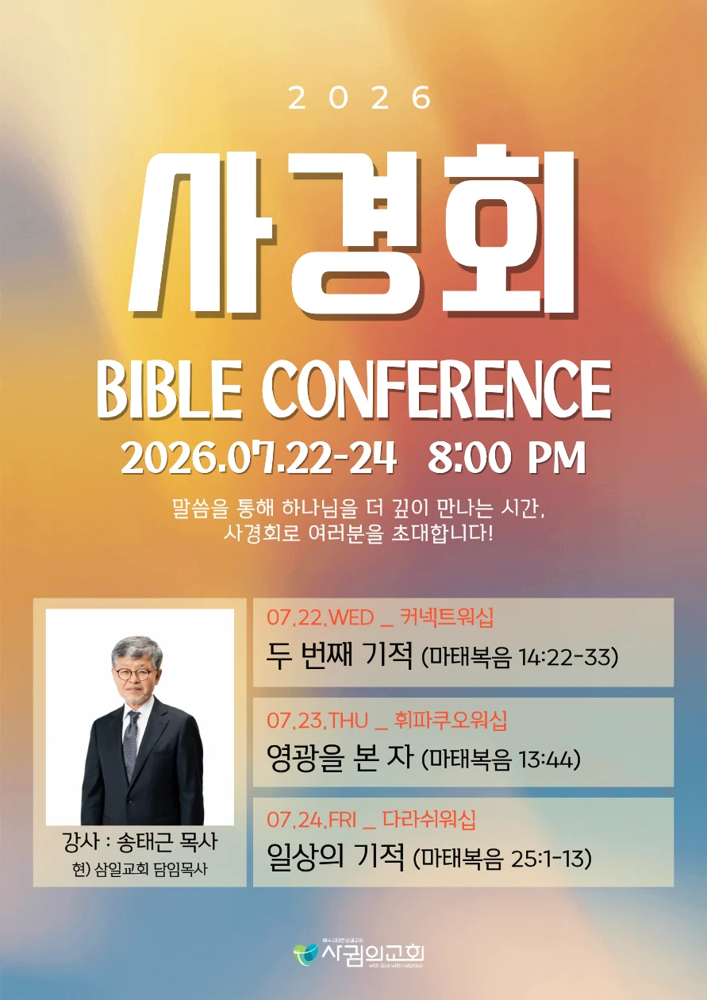
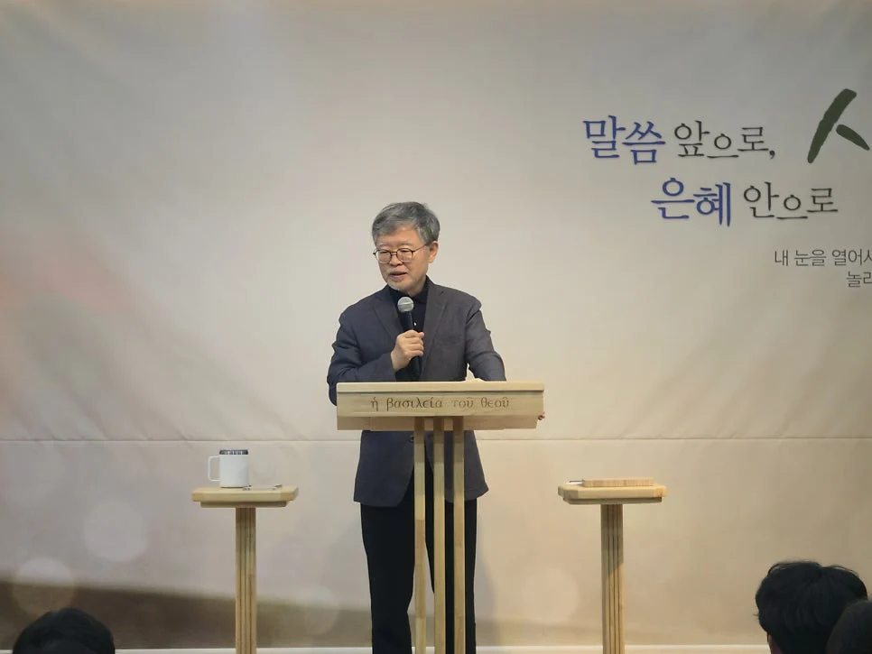

이번에 새로 옮긴 교회에서 첫 사경회를 맞이했어. 강사 목사님이 무려 삼일교회 송태근 목사님이라는 소식을 듣고 무조건 참석해야겠다고 다짐했지. 기대 이상으로 깊은 울림과 감동을 준 이번 사경회 후기, 그리고 십자가 앞에서 나를 돌아보게 만든 솔직한 이야기를 전해볼게!

▲ 사귐의 교회 7월 사경회 안내 포스터

교회에 처음 등록할 때 새가족 담당 자매님이 "7월 사경회에 삼일교회 송태근 목사님이 오신다"고 말해줬거든? 그 말을 듣자마자 '아, 이 교회는 진짜 믿을 만하다!'라는 생각이 확 들더라고.

사실 내 아내가 지난 5년 동안 삼일교회에 출석하기도 했고(우리 결혼식도 삼일교회에서 올렸지!), 삼일교회는 내가 지금까지 지내온 교단의 대표 격인 교회라 괜히 친숙함도 있었어. 그런데 알고 보니 우리 사귐의 교회 강정규 담임목사님과 송태근 목사님의 인연은 겨우 6개월 남짓밖에 안 되었다는 사실!

---

## 대형교회 목사가 내 블로그 비판글을 읽는다면?

두 분의 인연이 시작된 비하인드 스토리가 정말 영화 같아.

송태근 목사님이 CBS '성서학당'에 고정으로 출연하고 계시잖아? 어느 날 방송국 작가님이 조심스럽게 다가와서 "목사님, 어떤 블로그에 목사님 설교를 비판하는 글이 올라와 있어요"라고 말했대.

보통 자기 설교를 비판한다고 하면 악의적으로 공격하는 경우가 많잖아? 그래서 '도대체 무슨 글인가' 하고 직접 읽어보셨대. 그런데 그 글(강정규 목사님이 쓰신 글)은 공격이 아니라, 송태근 목사님을 존경하고 배려하는 마음을 담아 논리정연하게 비판한 글이었던 거지!

알고 보니 설교 중에 고린도전서와 고린도후서를 약간 헷갈려 말씀하셨던 거야. 송태근 목사님은 그 글을 읽고 본인의 실수를 바로 인정하시고, 방송에서 직접 정정 방송까지 하셨어. 진짜 이런 겸손함이야말로 어른의 진정한 모습이 아닐까?

그 후 송태근 목사님이 강정규 목사님께 메일을 보내셨어.

> "내가 잘못 설교한 부분을 지적해 주어서 고맙습니다."

당시 우리 담임목사님은 대만 단기선교 중이었는데, '삼일교회 송태근 목사'라는 이름으로 메일이 오니까 처음엔 스팸 메일인 줄 의심하셨대(웃음). 대형교회 큰 어른 목사님이 개척교회 목사에게 직접 연락을 줄 거라곤 생각도 못 하셨던 거지.

그 메일을 계기로 두 분의 감동적인 만남이 성사되었고, 이번 7월 사경회 강사 요청까지 일사천리로 이어지게 되었어. 진짜 인연이라는 건 참 오묘하고 감사해.

{/* 1회용 외부 링크 버튼 */}

  <a href="https://m.blog.naver.com/bcmm20th/224221021097" target="_blank" rel="noopener noreferrer" class="custom-blog-btn">
    📖 강정규 목사님 네이버 블로그 바로가기
  </a>

▲ 이번 사경회 강사로 오신 송태근 목사님

---

## 효율을 따지는 시대, 비효율의 집단이 되어야 하는 교회

아내와 연애하던 시절, 삼일교회에 세 번 정도 가서 예배를 드린 적이 있어. 그때는 내 마음의 문이 닫혀 있어서 그랬는지 설교가 귀에 잘 안 들어왔거든? 그런데 이번 사경회 첫날 설교를 듣는데... 와, 진짜 온몸에 소름이 돋을 정도로 감동을 받았어.

젊은 시절 시각장애인 사역을 오래 하셨다고 들었는데, 그래서인지 말씀하시는 내공과 전달력이 엄청나시더라고! 마치 1인극의 달인처럼 성경 속 장면이 눈앞에 생생하게 그려졌어.

특히 내 가슴을 때렸던 문장이 있어.

  
"모든 것이 효율로 평가받는 현대 사회에서, 교회는 가장 '비효율적인 집단'이 되어야 합니다."

예를 들어 500포기 김장을 할 때 교인 200명이 모여서 함께 참여하고, 남기는 것보다 먹는 게 더 많은 교회가 진짜 교회라는 말씀이야. 사람의 능력이나 효율을 보고 일하는 게 아니라, 하나님의 일하심을 기대하고 믿으며 서로 교제하는 시간 자체가 교회의 본질이라는 거지.

점점 전문화되고 기업화되어가는 한국 교회를 꼬집으시는데 얼마나 공감이 가던지!

---

## "주여, 나를 구원하소서!" 십자가 앞에서의 절규

설교 중 '오병이어' 사건 이후의 이야기도 깊은 깨달음을 줬어. 오병이어 기적이 일어나자 수많은 사람들이 벌떼같이 예수님께 모여들었잖아?

누군가는 먹을 것을 얻기 위해, 누군가는 정치적 해방을 원해서 모였지. 하지만 이런 헛된 야망에 복음이 섞이면 복음의 본질이 왜곡되기 때문에 예수님은 무리를 급히 해산시키시고, 제자들을 먼저 배에 타서 건너편으로 가라고 명령하셔.

예수님이 가라고 하신 길에서도 제자들은 풍랑을 만나게 돼. 70~80년대 기복신앙처럼 "예수 믿으면 부자 된다, 건강해진다"라는 메시지는 복음의 본질이 아니라는 거야.

풍랑 속에서 물 위를 걸어오시는 예수님을 보고 제자들은 유령(귀신)인 줄 알고 무서워했지. 그 당시 유대 사회 통념상 물에서 헛것이 보이면 귀신이라고 생각했거든. 예수님은 그 마음을 이해하시고 즉시 말씀하셔.

> "안심하라, 나니 두려워하지 말라."

이때 베드로가 "주님이시거든 나를 물 위로 오라 하소서"라고 외치고 물 위를 걷기 시작해. 하지만 일렁이는 바람을 '보고' 무서워하는 순간 바로 바닷속으로 빠져들지.

그때 베드로가 지른 절규를 우리는 기억해야 해.

  
"주여, 나를 구원하소서!"

이건 머리로 계산해서 나온 말이 아니야. 죽음의 공포 속에서 무의식적으로 터져 나온 처절한 절규였어. 사람이 신앙적으로 철이 들려면, 십자가 앞에서 이렇게 처절해져 봐야 해. 고상하게 겉모습만 유지하는 신앙으로는 진짜 변화될 수 없거든.

나는 과연 신앙생활을 하면서 십자가 앞에 무릎을 꿇고 "주여, 나를 구원하소서"라는 처절한 외침을 터트려 본 적이 있었나? 깊이 되돌아보게 되더라고.

---

## 진심이 아닌 '진리'를 좇는 삶

우리는 늘 "진심을 다해 산다"고 말하지. 하지만 잘못된 욕망과 진심이 만나면 히틀러처럼 수백만 명을 죽이는 괴물이 될 수도 있어. 그래서 우리는 단순히 내 '진심'을 믿는 게 아니라, 변하지 않는 '진리'를 좇아 살아야 해.

이번 사경회를 통해 하나님이 내게 주시는 말씀에 귀를 기울이고, 내 일상이 하나님의 통치를 받는 '하나님의 나라'가 되기를 간절히 소망해. 내 삶을 온전히 주님께 맡길 수 있는 믿음으로 오늘도 기쁘게 살아내야겠어!

{/* 2. 포스트 전용 1회용 CSS (MDX 파일 내부 스코프 격리) */}

{/* 3. 포스트 전용 1회용 JavaScript (클라이언트 상 실행) */}
